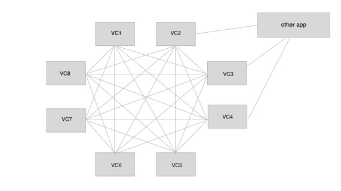
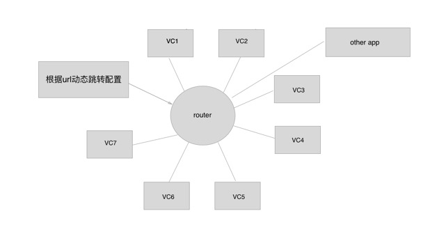

#Router 设计及思路
做Router的想法来自于viewController之间的跳转逻辑比较混乱，代码结构和设计不清晰，以及缺乏根据外链进行动态VC的跳转。所以决定做一个类似中间件的小模块来解决这几个问题。  

目前项目里针对页面之间，web和native，本地app和外部app之间的跳转存在以 下问题：  

* 1.项目内部跳转不清晰。比如VC1到VC2,VC2到VC3,VC3到VC8,VC8到VC1。有种坐船的感觉。  
* 2.不能根据web页或营销页进行动态跳转。比如上午需要VC1到VC2，下午营销修改要求VC1到VC5。除非事先代码写死，否则是不能根据后台配置做跳转的。   
* 3.第三点基于某些页面做降级使用，比如VC2有严重bug，能否降级成web页，让所有进这个类VC都进入web页，好控制风险。  
* 4.做打点统计，同时获得原控制器和目标控制器名称和参数。

怎么说呢~ 目前情况是这样的：  
  

期望是这样的：  

  

从图片来看，有一下优点：  

 * 1.使用中介者模式，从代码结构来看是清晰了很多。所有的页面跳转集中到一个模块管理。  
 * 2.url动态跳转，经过后台配置即可远程控制。
 * 3.基于第二点，往后可以做降级处理。如果使用新技术构建某个页面（如fluuter，swift),便可以降低风险。  

###下面介绍一下思路，遇见的问题及解决方案  

* 首先为了降低耦合，坚决不能#import其他控制器，使用反射机制生成VC。  
  
		Class vcClass = NSClassFromString(VCStr);
		viewController = [[vcClass alloc] init];  
		
由于NSClassFromString可以把已注册的类取出来，所以很方便的alloc。  
假如你想动态生成一个为注册的，可以考虑以下函数： 

		objc_allocateClassPair  
		objc_registerClassPair
		objc_disposeClassPair    
		
简单提一下，目前用不到。  

* 第二点是入参的问题，参数有基本类型:int,double,string  还有枚举，数组，字典，model，block。  
  把他们统一装入参数字典里，传入router类里  
  对于基本类型包一下即可。  
  数组和字典，model都是指针，也可以直接封装进参数字典。  
  block有点麻烦，但由于是函数指针，声明一下名字也可装入参数字典。  
  对于枚举，因为是int类型。目前做成int和enum的映射。
 
* 第三点是把参数付给下一个控制器
  直接使用KVC即可，需要注意的是 [setValue:forKey:]在没有key的时候系统会调用一系列函数，如果还没找到相应的key，系统最后会调用setValue:forUndefinedKey，并抛出异常。  
   以下函数重写一下
  
    
        @implementation NSObject (SafeNSKeyValueCoding)

    	-(id)valueForUndefinedKey:(NSString *)key{
			 NSLog(@"出现异常，该key不存在%@",key);
    	    return nil;
	    }
			
		-(void)setValue:(id)value forUndefinedKey:(NSString *)key{
			NSLog(@"出现异常，该key不存在%@",key);
		}
		@end  
		
	不过为以防没有相关key的时候，运行时检测一下该对象是否存在该属性也是必要的  
	
		// 检测对象是否存在该属性
		- (BOOL)checkIsExitPropertyWithInstance:(id)instance PropertyName:(NSString *)propertyName {
		    // 获取对象里的属性列表
   			 unsigned int outCount, i;
	   		 objc_property_t *properties = class_copyPropertyList([instance class], &outCount);
    
   		 	for (i = 0; i < outCount; i++) {
            	 objc_property_t property = properties[i];
		         // 属性名转成字符串
   			     NSString *proName = [[NSString alloc] initWithCString:property_getName(property)
                                                            encoding:NSUTF8StringEncoding];
       		     // 判断该属性是否存在
     	         if ([proName isEqualToString:propertyName]) {
   			       	  free(properties);
       			   	  return YES;
	        	  }
		    }
   			 	free(properties);
   	 			return NO;
		}

###关于使用：
目前提供两种方式做跳转，一种是url，一种是指定目标vc，参数，跳转方式。我称为url跳转和传统跳转。  
url跳转的优点就在于可以根据配置修改跳转页面，比如A到B，改为A到C。缺点是url有点长，需要写进参数，跳转方式。不能有指针对象传值，比如model，block。对于参数有局限性。  
传统跳转优缺点正好相反，参数无限制，原先怎样就怎样。但无法动态跳转。  

以上~

		
		

