#对称加密：
#####DES   
DES是1977年美国联邦信息处理标准中使用的一种对称密码技术，曾今被美国和其他国家政府银行使用。
不过现在已被暴力破解，我们除了用它解密以前的密文外，已不再使用DES了。不过这里我们可以用它来了解下什么是对称加密。

#####加密和解密
DES是一种把64比特明文加密成64比特的密文的对称密码算法，密钥长度56位，其中每隔7比特有个错误检查比特。结果DES密钥总长度为64比特。

#####分组密码
DES以64比特明文为一个单位进行加密，这64比特单位称为分组。so，以分组为单位处理密码的算法称为分组密码。DES属于分组密码。
DES每次只能加密64比特数据，如果明文较长，就需要对DES加密进行迭代，迭代的具体方式称为模式。后文会描述。
图DES加密与解密流程

#####三重DES
三重DES只是将DES重复3次，为了增加DES强度

#####AES
目前很安全
。。。。。

###分组密码模式
.....好多。。。。

#非对称加密
####公钥密码
在对称密码中，由于加密解密的密钥是相同的，因此密钥配送就成了问题。如过使用公钥密码，就解决了配送问题。
#####密钥配送问题：

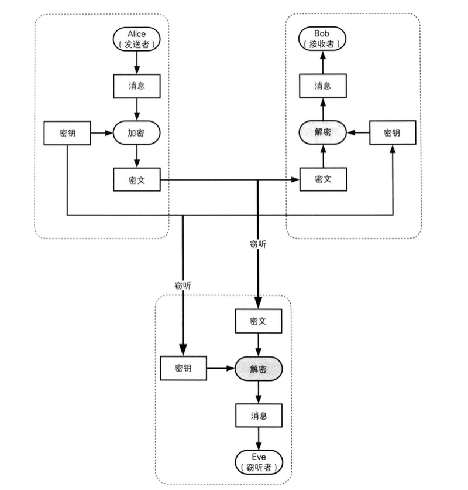

解决密钥配送有多个方法，但都很难处理  
1.双方通信时如果要加密，密钥不能在通信内容中。否则会被中间人窃听。  
2.双方可以事先共享密钥，如果双方离得很近自然好说。但如果离得很远就不能在消息里传播密钥，因为可能会被窃听。邮寄存储卡也可能会被窃取。假如一个公司有1000人需要彼此加密通信，那密钥数可能会达到50万个，这个不现实。  
3.如果有个密钥分配中心存储密钥，那1000人的数据库会有1000个密钥。但如果员工增加，密钥也要增加，数据库负荷会加大，如果数据库瘫痪，全公司的通信就会瘫痪。密钥分配中心也可能会遭到攻击.  
4.Diffie-Hellman密钥交换。是个方案。我们在后续会讨论  

#####公钥密码解决配送问题
两种密钥。一种是加密密钥，一种是解密密钥  
这里有公钥和私钥，公钥和私钥既可以当做加密密钥，也可以做解密密钥。只是使用场景不同  
你既可以用公钥加密，私钥解密。也可以用公钥解密，私钥加密。区别只是在于使用场景。  
公钥和私钥是一一对应的，一对公钥和私钥统称为密钥对  
我们来看一种公钥加密，私钥解密的情景。
Alice要发消息给Bob
1.Bob要接受消息，生成密钥对。私钥自己保管，公钥发给Alice
2.公钥被截获也没关系。因为公钥只负责加密
3.Alice用公钥对消息加密，发送给Bob。
4.即使密文中间被截获也没关系，公钥无法解密
5.Bob用自己私钥揭秘
如图所示
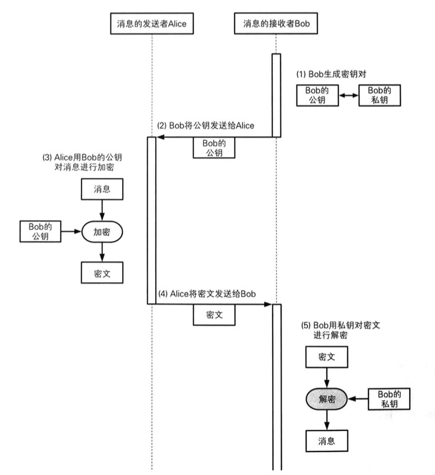
#####公钥密码的问题
1.公钥是否是正确合法的.假如中间人给你换了个公钥呢？  
2.处理速度要比对称加密慢很多，大约只有百分之一
我们后面讨论这两个问题

####RSA
RSA加密  
密文 = 明文 E mod N  (mod是取模的意思)  
E和N的组合就是公钥 简称 “公钥是(E,N)”

RSA解密  
明文 = 密文 D mod N  
D和N的组合就是私钥  

####中间人攻击
这个逻辑很简单，中间人替换掉了接受者得公钥，向对方提供了自己的公钥。结果发送者用的中间人的公钥加密消息发送出去，中间人接受到消息并用自己私钥解密得到明文。再伪造一个假消息用接受者的公钥加密还给接受者。具体流程如图：  
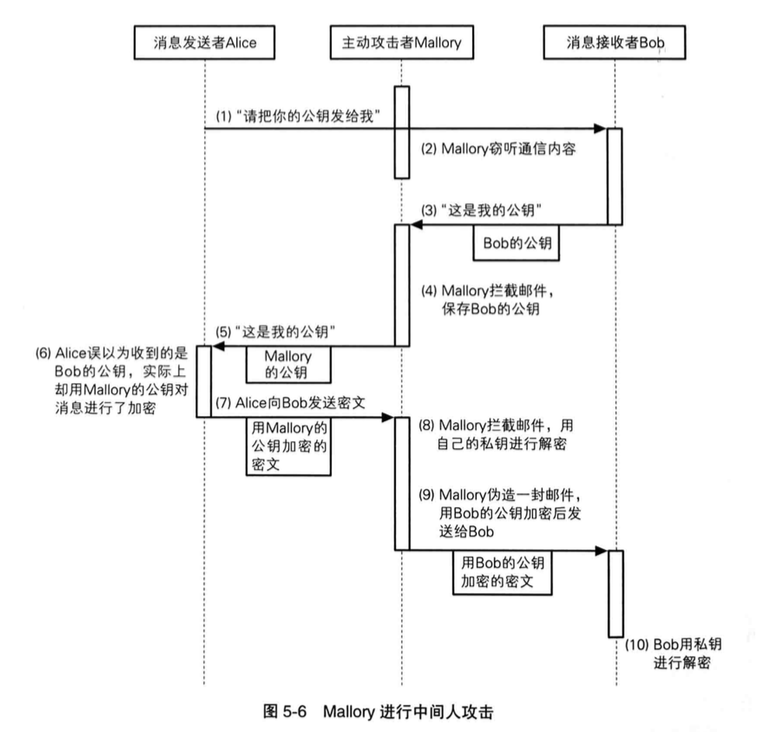

#混合密码技术
组成机制：  

 * 用对称密码加密消息  
 * 通过伪随机数生成器生成对称密码加密中使用的会话密钥  
 * 用公钥加密会话密钥  
 * 从混合密码系统外部赋予公钥密码时使用的密钥  

#######混合密码系统加密解密过程
加密：  

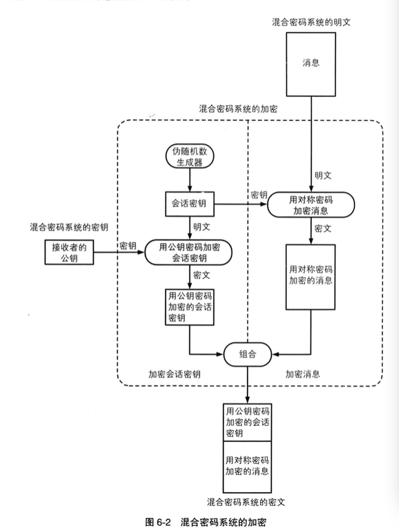

* 使用伪随机生成器生成会话密钥 ，会话密钥加密明文生成密文
* 用接受者的公钥加密会话密钥
* 两个密文组合后发送出去

解密：

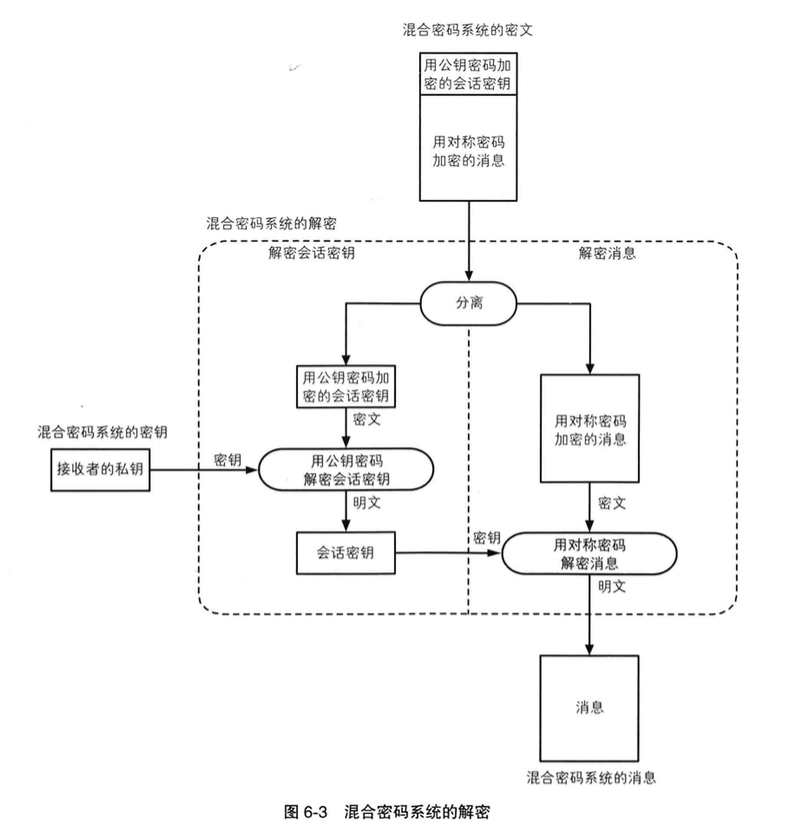
 
* 收到消息先解密会话密钥，用接受者的私钥解密，得到会话密钥
* 用会话密钥解密加密过得密文，即可得到消息

#认证
#####单向散列函数
输入称为消息，输出称为散列值。  
单向散列函数可以根据消息的内容计算出散列值，而散列值就可以被用来检查消息的完整性。  
######单向散列函数的性质：  
* 根据任意长度的消息计算出固定长度的散列值
* 能够快速计算出散列值
* 消息不同散列值也不同
	* 两个不同消息产生同一个散列值的情况称为碰撞
	* 要找到和该消息具有相同散列值的另外一条消息是非常困难的。这一性质称为弱抗碰撞性  
	* 要找到散列值相同的两条不同消息是非常困难的。称为强抗碰撞性
* 具备单向性

######关于术语
单项散列函数又称为消息摘要函数，哈希函数或者杂凑函数

######实际应用
* 检测软件是否篡改  
* 基于口令的加密（PBE）：原理是将口令和炎（伪随机数）混合后计算其散列值，然后将这个散列值用作加密密钥
* 消息认证码：检测并防止通信过程中得错误，篡改和伪装
* 数字签名
* 伪随机数生成器
* 一次性口令  
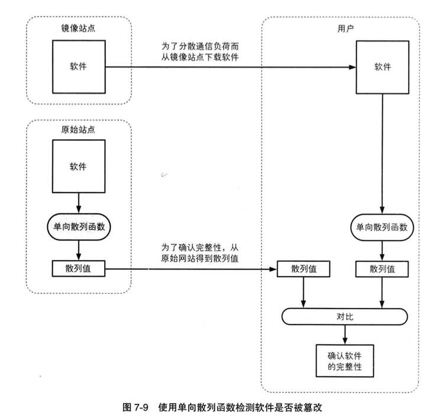

###消息认证码
消息的认证是指：“消息来自正确的发送者”。通过使用消息认证码，我们就可以同时识别出篡改和伪装，既可以确认消息完整性，也可以进行认证。 
消息认证码的输入包括任意消息的长度和一个接受者和发送者之间的共享密钥，输出是固定长度，这个数据称为MAC值。  
消息认证码是一种与密钥相关联的单项散列函数。  
如图：
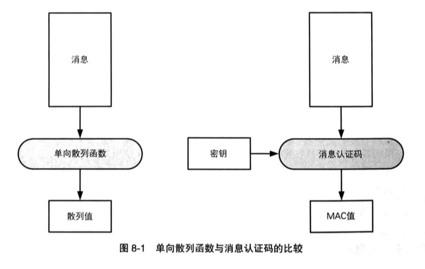

使用步骤：如图  

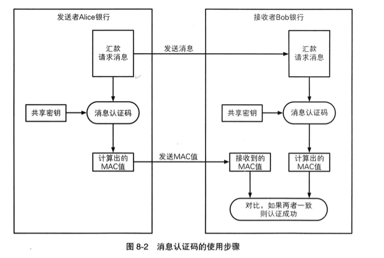

###数字签名  
数字签名就是将公钥反过来用实现的。  
公钥加密就是用公钥加密消息，用私钥解密密文。  
而数字签名是用私钥对消息生成签名，传输数字签名的密文，最后用公钥解密验证签名。  
如图所示：  
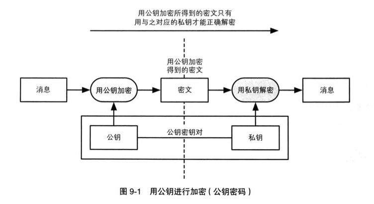  
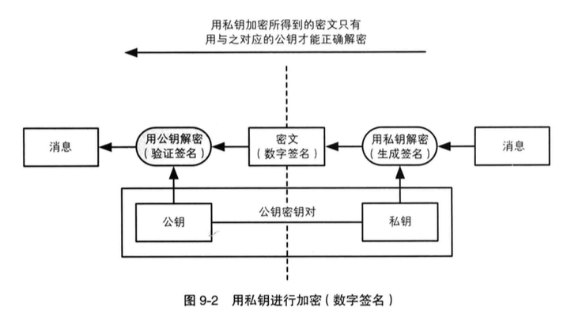  
解释一下：用私钥加密所得的密文，只能用公钥才能解密。这就是说，如果某个公钥成功解密了密文，那就证明这段密文是由与他配对的私钥进行加密所得的。  

#####数字签名方法  

 * 直接对消息签名  
 * 对消息的散列值签名  
 如图：  
 
 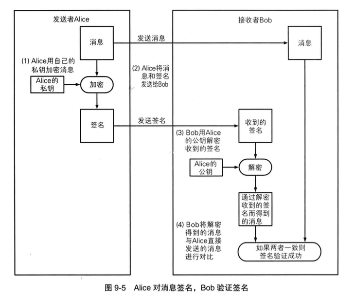   
 
 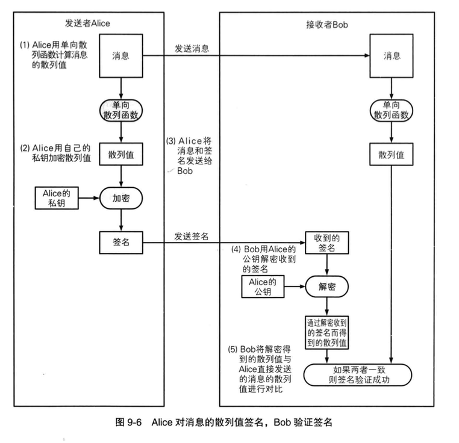    
 
 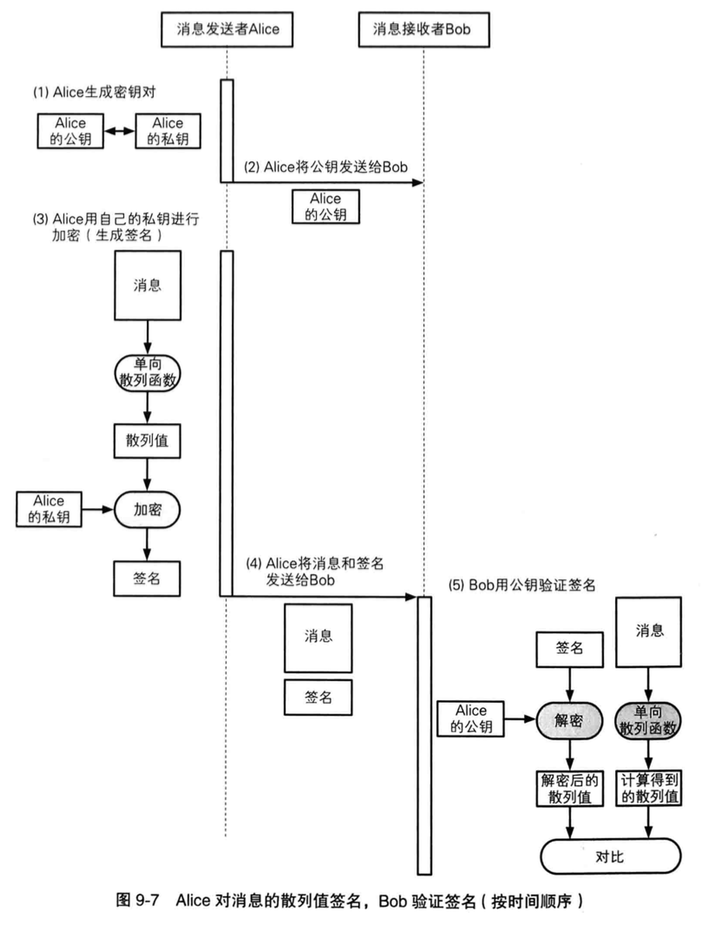
 
###通过RSA实现数字签名  
	
	签名 = 消息的D次方 mod N  
	D和N就是签名者的私钥  
	有签名求得的消息 = 签名的E次方 mod N  
	E和N就是签名者的公钥
	
##### 数字签名无法解决的问题  
公钥必须属于真正的发送者。即使数字签名算法再强大，如果你得到的公钥是伪造的，那么数字签名也会完全失败。我们需要使用一种社会性的基础设施，即公钥基础设施。简称PKI。  
见下文。  

#证书  
公钥证书和身份证，驾照很相似，里面有姓名，证件号，地址等个人信息，以及属于此人的公钥，由认证机构施加数字签名。只要看到公钥证书，我们就可以知道认证机构认定该公钥的确属于此人。公钥证书简称证书。  

#####证书应用场景  
如图：  

 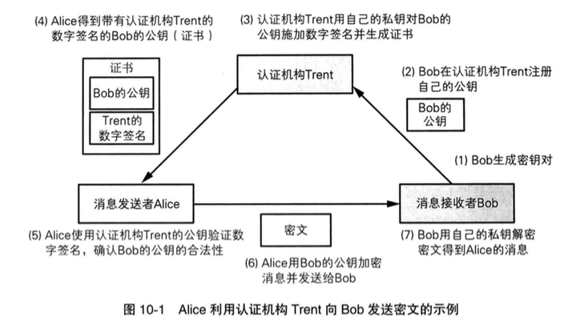

#公钥基础设施（PKI）
公钥基础设施是为了能够更有效地运用公钥而制定的一系列规范和规格的总称。  

#####PKI的组成要素   

 * 用户———使用PKI的人
 * 认证机构————颁发证书的人  
 * 仓库————保存证书的数据库  
 
######用户 
分两种：1.一种是使用PKI注册自己的公钥的人。
	   2.另一种是使用已注册的公钥的人。 

######认证机构（CA）  
  认证机构接受对证书进行管理的人。认证机构具体行为如下：  
  * 生成密钥对  
  * 在注册公钥时对本人进行身份认证  
  * 生成并颁发证书  
  * 作废证书  
 
#####仓库  
保管证书的数据库，也叫证书目录  

PKI组成要素  

 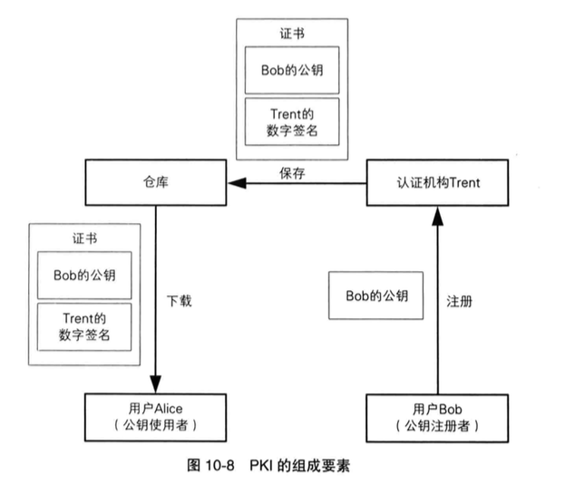

#密钥，随机数与应用技术  

####什么是密钥  
* 密钥本身就是一个巨大的数字，数字大小不重要，重要的是密钥空间的大小，也就是说可能出现密钥的总数量。因为密钥空间越大，暴力破解就越困难。密钥空间大小有密钥长度决定。  
* 密钥与明文是等价的，假如明文具有100万的价值，那么这段密钥也具有100万的价值；假如明文值1亿，密钥也值1亿。  
* 不要使用自己开发的密码算法进行加密，而是使用一个经过全世界密码雪茄共同验证的密码算法。如果你使用了自己的密钥，可能会出现你的密钥被长时间破解了，你依然无法知晓。   信息的机密性不应该依赖密码算法本身，而是依赖于妥善保管的密钥。

####Diffie-Hellman 密钥交换  
Diffie-Hellman 密钥交换算法，通信双方仅通过交换一些可以公开的信息就能够生产出共享密钥的  
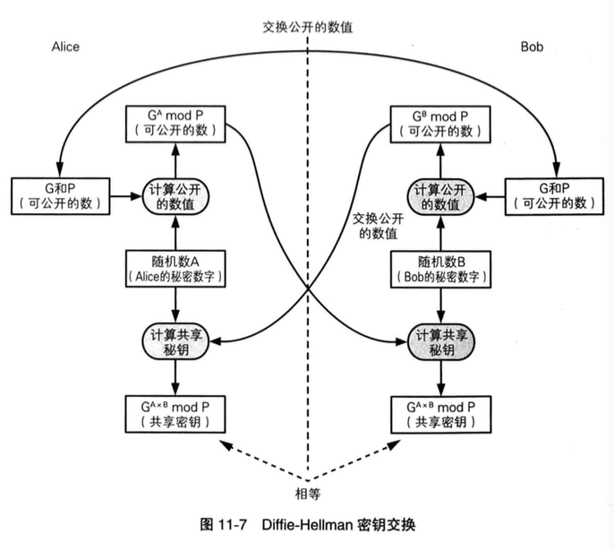
	
####基于口令的密码（PBE）！！待研.....
基于口令的密码就是一种根据口令生成的密钥并用该密钥进行加密的方法。其中加密和解密使用同一种密钥  
PBE加密过程如图：  

#随机数  
#####随机数的用途  
* 生成密钥  
	用于对称密码和消息认证码 
  
* 生成密钥对  
	用于公钥密码和数字签名
	
* 生成初始化向量（IV）  
	用于分组密码的CBC,CFB和OFB模式  
	
* 生成nonce  
	用于防御重放攻击以及分组密码的CTR模式等
	
* 生成盐  
	用于基于口令的密码（PBE）等  
	
其中生成密钥和生成密钥对是最重要的，即使密码强度再高，只要攻击者知道了密钥，就会立刻变得形同虚设。因此我们需要用随机数来生成密钥，使之无法被攻击者看穿。

#####随机数的性质  
* 随机性  
* 不可预测性  
* 不可重现性  

如图  

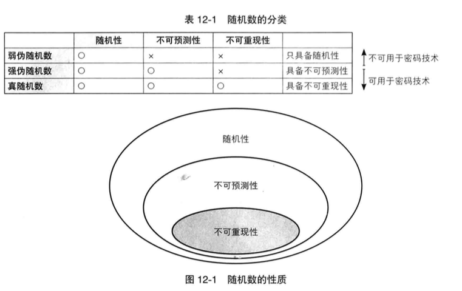

#####伪随机数生成器  
   通过硬件生成的随机数列是根据传感器收集的热量，声音的变化等事实上是无法预测的。像这样的设备就称为随机数生成器。  
   而可以生成随机数的软件则称为伪随机数生成器。因为软件无法生成真随机数。  
   
   伪随机数生成器具有“内部状态”，并根据外部输入的“种子”来生成伪随机数列  
   
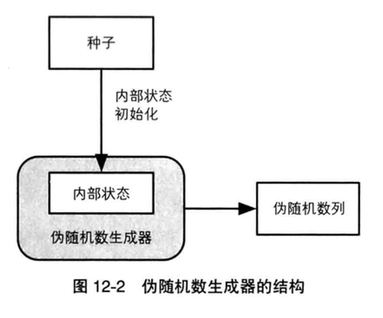
  
#####伪随机数生成器的内部状态  
   伪随机数生成器的内部状态，是指伪随机数生成器岁管理的内存中的数值。  
   
   当有一条伪随机数的请求时，伪随机数生成器会根据内存中的数值进行技术，并将结果输出。随后改变自己的内部状态。因此，根据内部状态计算伪随机数的方法和改变内部状态的方法组合起来，就是伪随机数生成的算法。  

#####伪随机数生成器的种子  
伪随机数的种子是用来对伪随机数生成器的内部状态进行初始化。伪随机数生成器是公开的，但种子是需要自己保密的。由于种子不可以被攻击者知道，因此不可以使用容易被预测的值。  

#PGP---密码技术的完美组合

